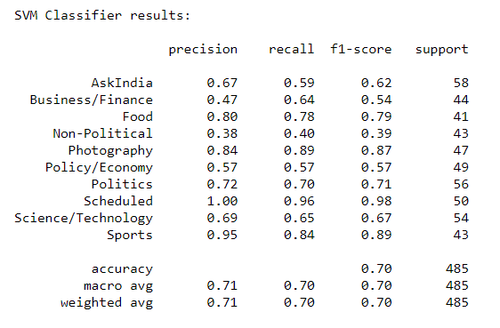

# Reddit Flair Detection

This project aims at predicting the flair/category of Reddit posts from r/india subreddit, using NLP and machine learning algorithms. It can be found in the form of a Flask web application deployed live on heroku. 

Access it at - https://rindia-flair-prediction.herokuapp.com/ 

### Structure 
- [extract_data.ipynb](https://github.com/harshita219/Reddit-Flair-Detection/blob/master/extract_data.ipynb) : Jupyter notebook containing all the code that was used to fetch data using PRAW API from reddit and creating a CSV file further data analysis and building the machine learning model.

- [EDA.ipynb](https://github.com/harshita219/Reddit-Flair-Detection/blob/master/EDA.ipynb) : Jupyter notebook containing the exploratory data analysis performed on the collected reddit-india-data.

- [flair_detector.ipynb](https://github.com/harshita219/Reddit-Flair-Detection/blob/master/flair_detector.ipynb) : Jupyter notebook containing all the code written for preprocessing the data, feature extraction, text data vectorization using NLP, and evaluating machine learning models while checking accuracies to save the best one for final predictions.

- [cleaning.py](https://github.com/harshita219/Reddit-Flair-Detection/blob/master/cleaning.py) : Python script containing functions to clean text in a dataframe. It helps in converting text to lower-case, removing URLs, punctutaions, stopwords, digits and lemmatization of words.

- [stop_hinglish](https://github.com/harshita219/Reddit-Flair-Detection/blob/master/stop_hinglish.txt) : Text file containing hinglish stopwords since quite many r/India posts have bodies or comments written in 'hinglish'.

- [rfd-webapp](https://github.com/harshita219/Reddit-Flair-Detection/tree/master/rfd-webapp) : Folder containg all files used for creating and deploying the Flask app on heroku.

- [requirements.txt](https://github.com/harshita219/Reddit-Flair-Detection/blob/master/requirements.txt) : Contains all Python dependencies of the project.

- vectorizer.pkl, LSA_topics.pkl, svm_model.pkl : Are saved files which are used in flask web-app.

### Project Execution
In order to run the website on localhost of your system, follow the given steps. Ensure that Python3, pip and virtualenv are already installed.
 
1. Open your Git Bash or terminal.
2. Clone this repository by entering ```git clone https://github.com/harshita219/Reddit-Flair-Detection.git``` 
3. Navigate to the website directory by entering ```cd Reddit-Flair-Detection/rfd-webapp``` in the terminal.
4. Create a virtual environment by executing the following command: ```virtualenv venv```
5. Activate the "venv" virtual environment by executing the following command: ```source ./venv/Scripts/activate``` for windows users and ```source venv/bin/activate``` for mac users.
6. Install the required dependencies by executing the command: ```pip install -r requirements.txt```
7. Now execute ```flask run``` and find the website live at http://127.0.0.1:5000/ on your system.

## Approach and experimenting
This section gives a detailed document of all the steps followed in order to extract data, EDA for gaining insights and getting into NLP to create a machine learning model.

### Part 1 - Reddit Data collection
The data is collected using PRAW (Python Reddit API Wrapper) package. The "inidia" subreddit has a vast variety of user-declared flairs which leads to increase in number of categories and some flairs are less genuine than others. To avoid this problem, only the officially mentioned flairs on the [r/india](https://www.reddit.com/r/india/) webpage are used. 

These are the 10 flairs used throughout the project. 


- In order to analyse data a bit, top posts over the period of a year are extracted to visualize the distribution in terms of flair. The posts were *very unequally* distributed with 50 % of them being Political and as less as 0.2 % as Scheduled.

- Such non-uniformity in data would be a problem for training the ML model. Hence another approach was adopted. Around 250 submissions were extracted under each flair, totalling upto a data of approx **2500 submissions**. This ensures proper uniform categorical data for training purposes.

**Attributes** extracted - *ID, Flair, Title, Body, Comments, Score, Author, URL, Number-of-comments, Timestamp. Domain* was extracted from URL and added as another feature.

### Part 2 - Exploratory Data Analysis
The EDA jupyter notebook contains a number of charts and graphs giving information about the data. 
- Top 20 Domains and number of submissions
- Flairs and their mean,max scores
- Average number of comments per post
- Title length of posts
- Time-series analysis
  - Which weekday gets the most submissions?
  - Getting more precise: Peak time in hours
- Looking into the text through wordclouds

### Part 3 - Building the flair classifier
The title, body and comments section of the dataframe was pre-processed using the clean_text function from cleaning.py file. 
> **Title + Body + Comments + Domain** were combined into one column called **CONTENT**. This is used as each row's *document* in NLP.
>
> The data is split into train:test ratio of 80:20.

Feature Extraction and training model...

 #### *Approach I : Generating max 5k features with n-grams using TF-IDF Vectorizer* 
 It automatically makes a vocabulary according to the term frequency and inverse document frequency of the words, and converts the documents into vector form. 

First, evaluation of unigrams and bigrams under each flair was done and output was pretty relatable to each flair. Hence, tf-idf vectorizer was passed (1,3) as ngram_range. It would ignore words which are present in less than 5 documents or more than 90% of documents. 

```TfidfVectorizer(max_features = 5000, ngram_range=(1,3), min_df=5, max_df=0.9, stop_words=cleaning.STOPWORDS )``` was fit and transformed on the 'content' of data.

The following results were obtained -
| Classifier | Accuracy |
| :---: | :---: | 
| Linear SVM | 68 % |
| Logistic Regression | 68 % | 
| Random Forest | 67 % | 
| Naive Bayes | 66 % |

#### *Approach II : Latent Semantic Analysis*
The tf-idf X matrix is sparse and contains 5000 features/weights of words. These are too many independent features for classifying documents. To overcome this, ***topic modelling*** can be a good approach. Classification implies that we have some known topics that documents are grouped into. In this project, one flair may have a number of topics, hence total topics in all documents might be a huge number, but definitely lesser than 5k independent features.

LSA comes into play as it attempts to capture the hidden concepts in documents, also known as topics. To reduce the dimensionality of tf-idf matrix and find latent topics, I will decompose it using Truncated SVD. Here is a function which will return the optimal number of components on the basis of explained variance and the goal variance.

> Now the question arises: *What is the best way to determine n_components (number of topics) in topic modeling?* Identifying the optimum number of topics in the given corpus text is a challenging task. But then I found [this](https://books.google.co.in/books?id=kIhQDwAAQBAJ&pg=PT154&lpg=PT154&dq=tsvd+optimum+components+explained+variance&source=bl&ots=OmYw-JgkJO&sig=ACfU3U0PtcsL_klxGIJIGZf7JSi01PIN4Q&hl=en&sa=X&ved=2ahUKEwitwdKQ1IPpAhVA73MBHY3EAmgQ6AEwBXoECAwQAQ#v=onepage&q=tsvd%20optimum%20components%20explained%20variance&f=false) extract which suggests to set a threshold of explained variance. Apart from that, there's a need to see the trade off between the number of features and explained variance. An automated loop was set which would return optimal num_components when explained variance reaches 90 %.

Optimal number of components (representing topics) came out to be 1138. After dimensionality reduction, ML models are evaluated again.

```tsvd = TruncatedSVD(n_components = 1138, n_iter=10, random_state=42)```

The following results were obtained -
| Classifier | Accuracy in % |
| :---: | :---: | 
| Linear SVM | 70 % |
| Logistic Regression | 69 % | 
| Random Forest | 68 % |

## Results
There was a slight increase in the accuracy after LSA. **Linear Support Vector Classifier scores the best accuracy of 70 %** with a classification report as given -



The best performance was given under Scheduled flair, obviously because most of them are mere discussion threads. Whereas Non-Political gives the worst performance, maybe because its content is quite ambiguous since most of the topics which aren't political can be put under this flair.

## Deployment on Heroku

A flask web-app was created which would predict the flair of posts using saved vectorizer and ML model. When URL of a r/india post is entered, it displays the title and predicted flair.

An automated testing checkpoint is also created. When a text file containing URLs, one in each line, is posted through a script, the website returns a JSON file with keys as URL and values as predicted flair. In order to test it, execute the given script:

```
import requests

files = {'upload_file': open('test.txt','rb')}
r = requests.post("https://rindia-flair-prediction.herokuapp.com/automated_testing", files=files)

with open('results.json', 'w') as f:
    f.write(r.text)
```
Save this as a python file, for example, script.py in the same folder as test.txt (which contains urls in each line). Executing the command ```python script.py``` would download results.json file in the same folder.

## References

https://www.storybench.org/how-to-scrape-reddit-with-python/  
https://towardsdatascience.com/text-classification-in-python-dd95d264c802  
https://github.com/TrigonaMinima/HinglishNLP/blob/master/data/assets/stop_hinglish  
https://stackoverflow.com/questions/38640109/logistic-regression-python-solvers-defintions  
https://www.analyticsvidhya.com/blog/2018/10/stepwise-guide-topic-modeling-latent-semantic-analysis/  
https://www.statisticshowto.com/explained-variance-variation/


